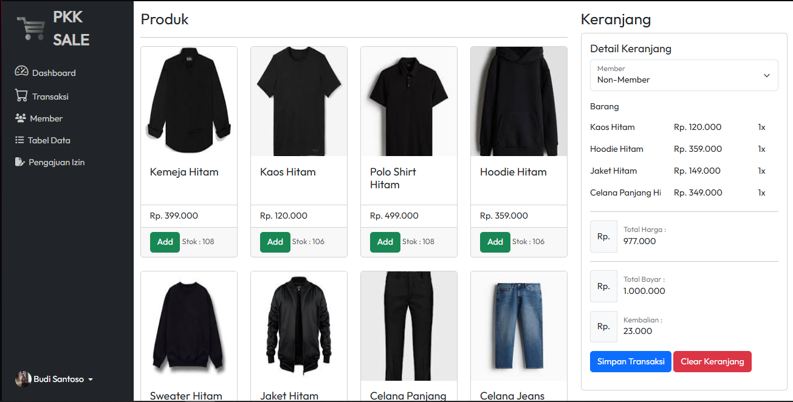

# Point of Sale (POS) Frontend — Laravel (Web)

This is the frontend project for a Laravel-based Point of Sale (POS) application. It consumes a REST API provided by the backend available at: [https://github.com/putra28/Ujikom-API](https://github.com/putra28/Ujikom-API).



---

## 🚀 Application Features

### 👨‍💼 Admin Panel

#### Dashboard
- Displays real-time date, monthly sales summary, revenue, and total products
- Shows user information
- Displays latest transaction history (all users)

#### Master Data Management
- Products: Full CRUD operations for products and their details
- Categories: Manage product categories
- Staff: Manage employee data
- Suppliers: Add, update, and delete suppliers
- Members: Manage customer membership records

#### Store Management
- Purchases:
  - View purchase records and details
  - Filter by date range
  - Add new product purchases from suppliers
  - Update purchase status
  - Delete purchase records
- Expenses:
  - View and filter expense data
  - Add or update expense records
  - Delete invalid expenses

#### Employee Management
- Shifts: Manage staff schedules
- Attendance: View and delete attendance records
- Leave Requests: Submit, update, and manage leave applications

#### Transaction Data
- Monthly transaction history and detailed views

#### Reports
- Stock: Track changes in product stock
- Sales Reports:
  - Annual sales summary
  - Best-selling products
  - Monthly sales chart
  - Top-performing employees
- Purchase Reports:
  - Yearly purchase summary
  - Most active suppliers
  - Most frequently purchased products
  - Monthly purchase charts
- Expense Reports:
  - Annual financial summary (revenue, COGS, net profit)
  - Income vs. expense comparison charts
    
---

### 🧾 Cashier Panel

#### Dashboard
- Monthly sales summary
- Latest transactions (specific to logged-in cashier)

#### Transactions
- Handle product sales

#### Member Management
- Add and view member data with details

#### Product List
- Browse all products and details

#### Transaction History
- View cashier-specific transaction history by date

#### Leave Requests
- Submit, view, and cancel leave requests

---

## 📦 Installation Guide

### 1. Clone This Repository

```bash
git clone https://github.com/putra28/Ujikom-POS
cd Ujikom-POS
```

### 2. Install & Run the API Backend
This project requires the backend API available at:
👉 [https://github.com/putra28/Ujikom-API](https://github.com/putra28/Ujikom-API)

Follow the installation instructions in that repository first.

Make sure the backend runs at http://localhost:1111 (or adjust the .env file in this frontend project accordingly).

### 3. Install Laravel Frontend (Web Version)
```bash
composer install
cp .env.example .env
php artisan key:generate
php artisan serve
```

## 📁 Folder Structure
```bash
/ujikom-pos
├── app/
├── bootstrap/
├── config/
├── database/
├── public/
├── resources/
├── routes/
├── storage/
├── tests/
├── .env.example
├── artisan
└── composer.json
```

## 📄 Notes
Login Accounts:
```bash
Username:081234567890
Password:admin

Username:08123456789
Password:kasir
```
- This project was developed for internal use/academic assessment and is not intended for direct production use.
- Be sure to update config/api.php with the API URL you're using locally.
